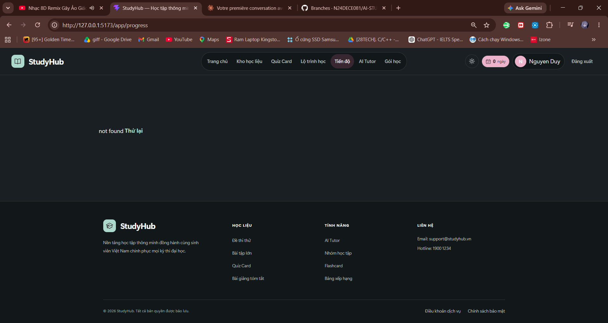

# Báo cáo sửa đồng bộ tiến độ

## Nguyên nhân gốc

- Quiz Card có gọi `POST /api/quizzes/:id/answers` (payload `run_id`, `answers`, `revision`, HTTP 200), nhưng chỉ lưu JSON lượt làm bài. `/api/progress` chỉ đọc JSON bài đã nộp nên bỏ sót các câu đang làm. Cookie và quyền sở hữu không phải nguyên nhân của lỗi này.
- Quiz nhanh trong chat Nova chỉ chấm/cập nhật state frontend. Trắc nghiệm trong bài tập Lộ trình lưu ở `tutor_submissions`, không đi vào nguồn thống kê Quiz.
- Review Flashcard lưu `remembered` trong bộ thẻ nhưng thiếu thời điểm và lịch sử review; sửa bộ thẻ có thể làm mất thời điểm ghi nhớ.
- Tiến độ không được refetch thống nhất sau các thao tác học. Insights có câu tăng 24% cố định. Đồng hồ lấy thời gian từ lúc đăng nhập, cộng cả thời gian không học.
- Nhóm ngày GMT+7 trước đây không phải lỗi chính. Các bản ghi mới lưu UTC và nhóm ngày GMT+7 mặc định của ứng dụng.

## Kết quả

- Thêm bản ghi QuizAttempt, QuizAnswer, FlashcardReview, StudyEvent, khóa ngoại/index/khóa duy nhất và migration phiên bản 11. Backfill lượt làm Quiz cũ; không xóa dữ liệu cũ.
- API dùng tài khoản từ cookie; kiểm tra quyền sở hữu; server tự chấm đáp án. Nộp lặp và retry mất phản hồi không tạo thêm lượt, câu trả lời hoặc XP.
- Quiz Card, Quiz nhanh Nova và trắc nghiệm bài tập Nova dùng chung nguồn tiến độ. Bài tự luận/tính toán/code và logic thích nghi lộ trình được giữ nguyên.
- Lưu từng đáp án, tiếp tục lượt chưa nộp, hàng đợi localStorage riêng từng tài khoản, tự retry khi online. Giữ hàng đợi khi đăng xuất để lần đăng nhập đúng tài khoản sau có thể đồng bộ; không hiển thị hoặc gửi hàng đợi dưới tài khoản khác.
- Đáp án quiz có hẹn giờ được chọn offline trước hạn vẫn đồng bộ theo thời điểm thao tác. Đáp án sau hạn không được tính. Đây là quiz luyện tập: thời điểm offline do client cung cấp và được kiểm tra hợp lệ, không phải cơ chế chống gian lận cho thi có giám sát.
- Bốn thẻ số liệu, biểu đồ 7 ngày/8 tuần/6 tháng, nhiệm vụ hôm nay và Insights đọc dữ liệu server. Thời gian học dùng heartbeat khi đang học và có tương tác, không cộng thời gian tab đóng/ẩn/idle hay cộng trùng thiết bị.
- Giữ token/hiệu ứng hiện có; chỉnh nền trang Tiến độ để chữ rõ ở dark mode, giữ các cột biểu đồ cùng một hàng trên mobile. Không thêm dependency hoặc chuyển framework.

## Kiểm thử

- Backend: `python -m unittest discover -s tests`: 194 bài, 192 qua, 2 bỏ qua theo cấu hình sẵn; không có assertion lỗi. Một số fixture cũ còn ResourceWarning khi đóng tài nguyên; không ảnh hưởng kết quả assertion.
- Frontend: 17 kịch bản E2E liên quan đã qua sau chạy lại các kịch bản cần sửa fixture/đợi transition: Home/auth, lazy loading, quyền gói, tạo thủ công, quote SH, các sửa Quiz trước đó và 5 kịch bản đồng bộ tiến độ. Không tuyên bố đã chạy toàn bộ 33 E2E của repository.
- Tài khoản mới: số liệu 0, biểu đồ có hướng dẫn, không số minh họa cá nhân.
- Quiz 3/5: 5 câu trả lời, 3 đúng, 60%, 35 XP, streak 1; tiếp tục giữa chừng không mất đáp án. Hai thẻ đã nhớ: 2 thẻ, tổng 45 XP. Số liệu giữ nguyên sau reload/logout/login.
- Offline → reload → online, mất phản hồi submit, retry, đổi tài khoản: đồng bộ đúng, không trùng XP hoặc lẫn dữ liệu tài khoản.
- Nova nhanh và bài tập trắc nghiệm: chấm theo server, lưu/khôi phục kết quả, nộp lặp không trùng. Backend có kiểm tra đồng thời, quyền sở hữu, UTC/GMT+7, gap streak, đồng hồ idle và hai thiết bị.
- Tiến độ: ảnh 1440/390px sáng/tối, kiểm tra không tràn ngang/không xuống hàng biểu đồ và tương phản chữ >= 4.5 sau khi transition hoàn tất. Home kiểm tra đủ 1920/1440/1024/768/390px.
- Build production, ESLint phần đã sửa và `git diff --check` qua. App bỏ qua riêng rule export component đã có sẵn do export PLANS.
- MySQL: kiểm tra chuyển schema/timestamp/index; chưa chạy integration trên MySQL thật. Các API integration dùng SQLite riêng, không đụng DB/tài khoản thật.

## File trong đợt sửa tiến độ

Tạo mới:

- `apps/python-api/backend/app/study.py`
- `apps/python-api/tests/test_progress_sync.py`
- `frontend/src/utils/studySync.js`
- `frontend/src/hooks/useStudySync.js`
- `frontend/src/hooks/useProgressData.js`
- `frontend/tests/progress-sync.e2e.cjs`
- `docs/progress-sync-report.md`

Sửa:

- `apps/python-api/backend/app/db/schema.sql`
- `apps/python-api/backend/app/db/mysql.py`
- `apps/python-api/backend/app/ai_tutor/repository.py`
- `apps/python-api/server.py`
- `frontend/src/App.jsx`
- `frontend/src/App.css`
- `frontend/src/api.js`
- `frontend/src/components/QuizWorkspace.jsx`
- `frontend/src/components/StudyDeckSession.jsx`
- `frontend/src/components/quiz-card/QuizCardPage.jsx`
- `frontend/src/components/ai-tutor/AITutorMessage.jsx`
- `frontend/src/components/ai-tutor/AITutorQuiz.jsx`
- `frontend/src/components/ai-tutor/AITutorExercise.jsx`
- `frontend/src/components/progress/ProgressDashboard.jsx`
- `frontend/src/components/progress/progress-dashboard.css`
- `apps/python-api/tests/test_server_integration.py`
- `apps/python-api/tests/test_ai_tutor_journey.py`
- `apps/python-api/tests/test_flashcards.py`
- `frontend/playwright.config.cjs`
- `frontend/tests/manual-learning.e2e.cjs`

Fixture AI/Lộ trình được cấp gói phù hợp chỉ trong DB kiểm thử; không sửa logic quyền gói/thanh toán. Các thay đổi sẵn có trong worktree và file môi trường được giữ nguyên.

## Dữ liệu giả và giới hạn kiểm tra

Không còn số liệu hoạt động giả/câu tăng 24% trong trang Tiến độ. Mục tiêu mặc định 10 thẻ, 20 câu, 30 phút là mục tiêu nhiệm vụ, không phải hoạt động đã hoàn thành. Insights dùng thống kê thật, không gọi model để bịa nhận xét.

Ứng dụng hiện dùng GMT+7; chưa có màn hình cấu hình múi giờ riêng. Lịch sử review cũ không có timestamp không được dựng thành lịch sử giả. Quiz AI vẫn yêu cầu cấu hình provider như lựa chọn của bạn; chưa kiểm tra tạo Quiz bằng provider thật.

Ngày 03/10/2026: đã khởi động lại backend local để nạp code và chạy migration trên DB hiện có. Nguyên nhân trang Tiến độ hiển thị `not found`: hai tiến trình backend cũ chạy trùng cổng 5000, chưa có các endpoint mới. Đã dừng hai tiến trình cũ, giữ một backend mới; kiểm tra qua proxy frontend xác nhận cả ba endpoint summary/timeline/today-tasks trả 401 khi không có cookie (đúng yêu cầu đăng nhập), thay vì 404. Yêu cầu `/api/study-time` từ phiên trình duyệt hiện có vẫn trả 200. Không thay đổi cấu hình AI hoặc giao diện; chưa kiểm tra trực quan trang trong phiên đăng nhập hiện tại, cần tải lại trang hoặc nhấn **Thử lại**.
